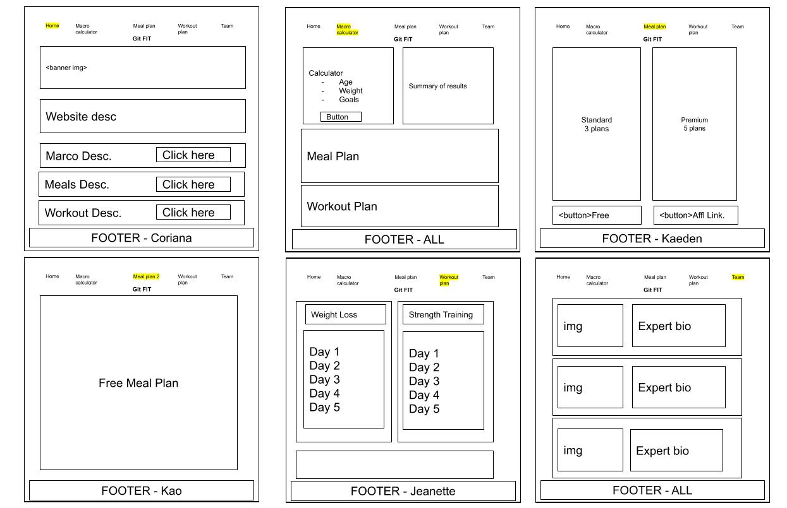
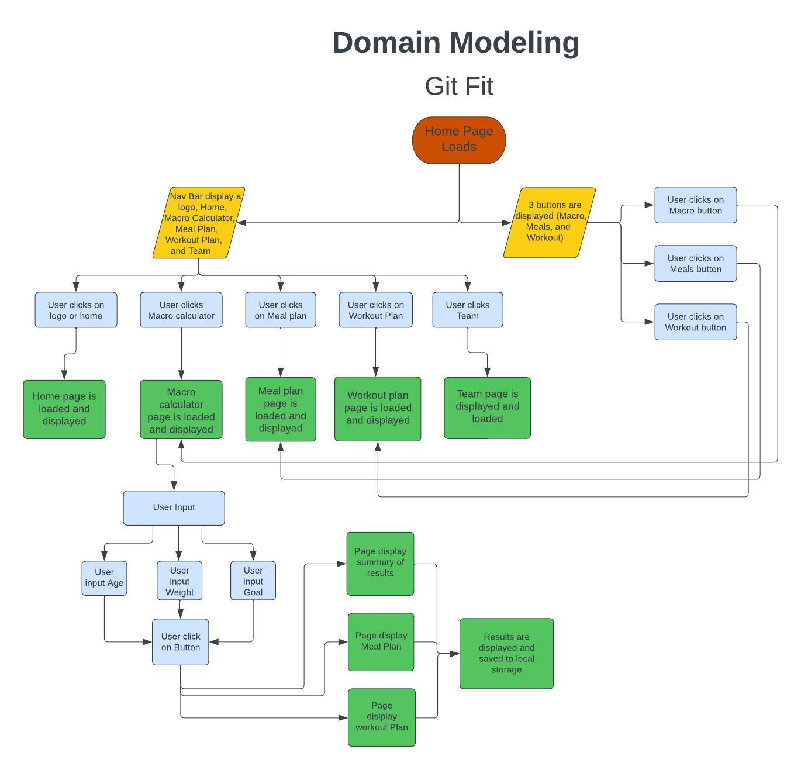

# Project Name: Git Fit

### Team Members

Jeanette Leyva,
Kaeden O'Meara,
Kao Saelor,
Coriana Williams

### Description

Git Fit is the perfect fitness website for anyone looking to take their health and fitness to the next level! With our macronutrients calculator, meal plans, and workout plans, you'll be able to achieve your fitness goals in no time. Our experts have crafted meal and workout plans specifically tailored to your individual needs.

### Problem Domain

GitFit is a fitness website that helps people achieve their health and fitness goals by providing macro calculators, meal plans, and workout plans. It solves the problems of users not knowing how to calculate their macronutrients, how to create a nutritious meal plan, and how to design an effective workout plan.

### Tools, Languages, Libraries, Frameworks, or Packages Used for this Project:

Tools: Git, GitHub, Google Draw, LucidChart.

Languages: HTML, CSS, and JavaScript.

### WireFrame for Git Fit

### User Stories

User stories are a way to describe a feature or functionality of a product from the perspective of the user. They provide a concise description of the functionality that is being delivered, who the user is, and the benefit they will get from it.  The following link demonstrates five different types of user stories for our website: [User Stories](https://trello.com/b/ug6JMxCE/gitfit)

### Domain Modeling
We have created a domain model for Git Fit below to help identify the key entities and their relationships to ech other.

Thank you and let us know if you have any questions!
